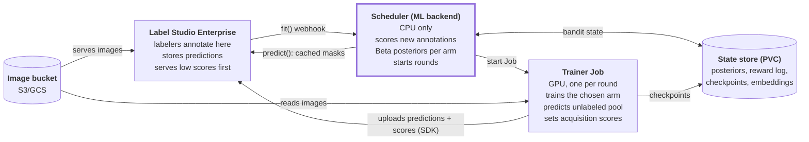

# Maestro: Active Learning with Bandit Model Selection for Label Studio

Sep 29, 2026 · Chris Crutchfield · Source doc: https://claude.ai/code/artifact/253675b4-22e3-46e1-9703-3d4b58d8d38e

## Summary

Maestro plugs into Label Studio Enterprise as its ML backend and uses a multi-armed bandit to decide which model and which task-selection strategy drive labeling. The first use is instance segmentation of fish, but nothing in the core loop is fish- or segmentation-specific.

Labeling is the bottleneck. Active learning cuts the number of labels needed by asking people to label the images a model learns most from. But which model (and which way of picking images) works best is unknown up front, and it changes as labels accumulate.

Following Sherlock, each arm is a model plus query strategy. Thompson sampling over Beta posteriors picks which arm to train and which arm chooses the next tasks. The reward comes free from Label Studio: each new human annotation scores the predictions every arm made on that image before it was labeled.

## Background: Sherlock

[Sherlock](http://kastner.ucsd.edu/wp-content/uploads/2022/04/admin/todaes22-sherlock.pdf) (Gautier, Althoff, Crutchfield, Kastner) is an active-learning design-space explorer for FPGA HLS, where each evaluation is a synthesis run taking hours. It showed no single surrogate model wins on every design space, so it learns which one to trust with a bandit.

- Each surrogate model is an arm with a Beta(α, β) posterior, starting at Beta(1, 1).
- Each iteration draws θ from every arm's posterior and uses the arm with the largest draw (Thompson sampling).
- The reward x is 1 if the chosen model's pick improved the Pareto hypervolume, else 0; then α += x·r and β += (1 − x)·r.
- The reshaping factor r (10 in the paper) makes the policy greedier and lets a model that only becomes good late take over quickly.
- With model selection, Sherlock matched or beat the best single model without knowing it in advance.

| Sherlock | Maestro |
| --- | --- |
| Expensive evaluation: an FPGA synthesis run | Expensive evaluation: a person annotating an image |
| Unevaluated design space | Unlabeled image pool in the Label Studio project |
| Arm: surrogate regressor | Arm: segmentation model + query strategy |
| Surrogate picks the next design | Arm's query strategy picks the next tasks to label |
| Reward: did hypervolume improve (0/1) | Reward: instance-mask IoU of the arm's prediction vs the new annotation (0 to 1) |
| Surrogate refit every iteration, cheap | Trainer is a GPU Kubernetes Job, expensive and slow |
| TED picks the initial samples | Zero-shot arm and random picks cover the cold start |

## Decisions and scope

| Topic | Decision | Consequence |
| --- | --- | --- |
| Labeling tool | Label Studio Enterprise | Built-in uncertainty sampling orders tasks by prediction score, so Maestro steers task order by writing scores |
| First task | Fish instance segmentation | Reward needs per-instance mask matching |
| Label form | Brush masks (BrushLabels, RLE) | Predictions and annotations are RLE-encoded masks, one region per fish |
| Images | Cloud storage bucket (S3/GCS) | Trainers read the same bucket Label Studio serves from; no copying into the PVC |
| Arm | Model family × query strategy | 3 × 3 = 9 arms at start; list kept in config |
| Reward | Matched mask IoU, used as a fractional Beta update | Keeps Sherlock's Beta/Thompson setup and uses the full signal |
| Seed data | None; cold start | A zero-shot arm and random sampling carry the first rounds |
| GPU budget | Unknown | Design for 1 concurrent trainer; batch Thompson draws when more are available |

**Goals**

- Labelers work only in Label Studio: predictions appear as editable pre-annotations and the next task is chosen for them.
- The system learns, per project, which model and strategy reduce labeling effort fastest.
- Task type is a plug-in: segmentation first, classification and detection later without changing the bandit or scheduler.
- Each developer can spin up an isolated stack with `maestro_cli`, as today.

**Non-goals for v1**

- Hyperparameter search inside an arm.
- A custom labeling UI or annotator management.
- Multi-project scheduling or fair sharing of GPUs across projects.

## Architecture

The scheduler is a thin, CPU-only Label Studio ML backend that holds the bandit; all GPU work happens in short-lived trainer Jobs that write predictions straight back to Label Studio.



Label Studio talks only to the scheduler; the trainer writes its results back to Label Studio directly, so the scheduler never runs a model.

**Components**

- **Label Studio Enterprise**: the project, tasks, annotations and stored predictions. Sends annotation webhooks to the backend and orders tasks by prediction score.
- **Scheduler (ML backend)**: one pod per developer stack, started by `maestro_cli`, reached through the ingress. Implements `fit()` and `predict()`, records rewards, updates the bandit and starts trainer Jobs. No GPU.
- **Trainer Job**: one Kubernetes Job per training round, with a GPU. Trains one arm from its last checkpoint, runs inference on the unlabeled pool, and pushes predictions and scores to Label Studio via the SDK.
- **Bucket**: the images, read by Label Studio and by trainers.
- **State store**: bandit posteriors, reward log, arm checkpoints and embeddings. The PVC the CLI already creates is enough for v1.

**The loop**

1. A labeler submits an annotation in Label Studio.
2. The `ANNOTATION_CREATED` webhook calls `fit()` on the scheduler.
3. `fit()` finds the predictions every arm stored for that task, scores each against the annotation, and updates each arm's posterior.
4. After every k new annotations, and if no trainer is running, `fit()` Thompson-samples an arm and starts a trainer Job for it.
5. The trainer fine-tunes the arm on all annotations so far and saves a checkpoint.
6. The trainer runs every arm's latest checkpoint over the unlabeled pool and uploads predictions tagged with `model_version = <arm>@<round>`.
7. The chosen arm's query strategy sets the `score` on its predictions, so Label Studio's uncertainty sampling serves the tasks that arm wants labeled next.
8. Labelers see the chosen arm's masks as pre-annotations, fix them, submit, and the loop repeats.

## Arms

v1 starts with three model families and three query strategies, giving nine arms; the list lives in a config file so arms can be added without code changes.

**Model families**

| Family | Why it is in the pool | Trains? | Notes |
| --- | --- | --- | --- |
| Zero-shot: Grounding DINO ("fish") + SAM | Useful with zero labels; covers the cold start | No | Should fade as trained arms overtake it |
| YOLO-seg (Ultralytics) | Fast to train and run; suits frequent retraining | Yes | AGPL-3.0 license; confirm acceptable for E4E |
| Mask R-CNN (torchvision) | Strong, well-understood baseline; permissive license | Yes | Slower per round |

**Query strategies**

| Strategy | Picks images where | Acquisition value per image |
| --- | --- | --- |
| Uncertainty | The model is least sure | 1 − mean instance confidence, plus a term for low-confidence detections near threshold |
| Diversity (coreset) | The image is unlike anything labeled so far | Distance from the image embedding to the nearest labeled embedding |
| Random | Anywhere | Uniform random; baseline and guard against sampling bias |

**Arm contract.** Every model family implements the same small interface, which is also how new task types plug in:

- `train(annotations, checkpoint) -> checkpoint`
- `predict(images, checkpoint) -> instances` (mask, class, confidence per instance)
- `embed(images, checkpoint) -> vectors`, used by the diversity strategy
- `to_ls(instances) -> Label Studio result` and `from_ls(result) -> instances`, the only code that knows about brush RLE

A query strategy is a function of the arm's predictions and embeddings over the unlabeled pool, returning one acquisition value per task.

## Bandit and reward

Every new annotation yields an IoU score for every model. The bandit is rewarded only on a small random audit slice, so arms that differ only in query strategy can still be told apart.

**Per-image score.** Predicted and annotated fish are matched one-to-one by mask IoU (Hungarian matching, a match needs IoU ≥ 0.5). Unmatched predictions and missed fish count as 0:

```
IoU_img = ( Σ over matched pairs (p, g) of IoU(p, g) ) / max(|P|, |G|)
```

An image with no fish and no predictions scores 1. The score lies in [0, 1], penalizes both false positives and misses, and is cheap to compute in the scheduler.

**Two uses of the score**

1. **Model scoreboard, full information.** Every model's latest checkpoint predicts every unlabeled task, so each annotation scores all models at once. A running mean per model decides whose masks labelers see as pre-annotations. This is cheap and needs no exploration.
2. **Arm bandit, Sherlock-style.** Arm (m, s) is played for one round: strategy s picks the next batch of tasks and model m is retrained on them. Its reward is the retrained model's IoU on the **audit tasks** labeled in the following round, applied per audit image as a fractional update:

```
α[m,s] += r · IoU_img
β[m,s] += r · (1 − IoU_img)
```

**Audit tasks.** A fixed share of every batch (starting at 15%) is chosen uniformly at random, whatever the arm. They give an unbiased measure of model quality; scoring on the arm's own picks would punish arms that deliberately choose hard images.

**Model quality drifts.** The best arm with 50 labels is rarely the best with 2,000. Two mechanisms, both configurable:

- Reshaping factor r, as in Sherlock (start at r = 1; test up to 10).
- Discounting each round, α ← 1 + γ(α − 1) and likewise β, with γ around 0.9, so old evidence fades.

**Cold start.** The first batch (e.g. 50 tasks) is random and pre-annotated by the zero-shot arm. Zero-shot arms never retrain, so their reward stays roughly constant; they act as a baseline that trained arms must beat.

**Unknown GPU budget.** With G trainers allowed, each round draws from the posteriors and plays the top G distinct arms. v1 assumes G = 1. Inference over the pool runs once per round for every trained model, in the same Job.

**Round trigger.** A round starts when k new annotations have arrived since the last round (start with k = 50) and no trainer is running. "Start Training" in Label Studio forces a round.

## Label Studio integration

Maestro uses only Label Studio's standard ML-backend and SDK surfaces; the prediction `score` field is the single channel that steers task order.

| Touchpoint | Direction | Maestro's use |
| --- | --- | --- |
| ML backend connection | LS → scheduler | Project connects to `https://<ingress_url>`; the scheduler serves `label-studio-ml`'s app (already wired in `label_studio_scheduler.py`) |
| `fit(ANNOTATION_CREATED / UPDATED)` | LS → scheduler | Score all stored predictions for the task, update scoreboard and bandit, maybe start a round. Must return quickly |
| `fit(START_TRAINING)` | LS → scheduler | Manual "Start Training" button forces a round |
| `predict(tasks)` | LS → scheduler | Returns the cached prediction of the current best model for that task. No model runs in the scheduler pod |
| Prediction import (SDK) | Trainer → LS | Bulk-uploads predictions per round, each with `model_version`, `score` and brush-RLE `result` |
| Task and annotation reads (SDK) | Scheduler, trainer → LS | Trainer pulls all annotations for training; images come from the bucket via the task's storage URL |
| Task sampling: uncertainty | LS internal | Serves tasks with the lowest prediction score first, so Maestro sets score = 1 − normalized acquisition value |

**Conventions**

- `model_version = "<family>+<strategy>@<round>"`, e.g. `yolo-seg+coreset@7`. Label Studio then records which arm made every prediction, and the reward can be computed from Label Studio alone.
- Only the playing arm's predictions carry acquisition-based scores and are the project's active model version. Other models' predictions are uploaded under their own versions for scoring only.
- Brush masks use Label Studio's RLE format; `label_studio_converter.brush` provides the encode and decode helpers. Each fish is one BrushLabels region.
- The scheduler and trainers authenticate with a Label Studio API token stored as a Kubernetes secret.

**To verify with the Enterprise instance**

- Uncertainty sampling reads scores from the project's selected model version only, and orders lowest score first.
- Bulk prediction import handles thousands of tasks per round within acceptable time.
- Enterprise's own prediction-vs-annotation agreement metrics support brush masks; if they do, they could replace some scheduler-side scoring.

## Changes to existing repos

The CLI and container plumbing are kept; most of the scheduler and trainer logic is new.

**maestro_cli** (keep, fix)

- Add config keys for the Label Studio URL, project id, bucket, and the names of the API-token and bucket-credential secrets; pass them to the scheduler as environment variables.
- Fix `spin down`: it deletes in the hard-coded `krg-maestro` namespace instead of the configured one, and deletes pods twice.
- Fix the `--storage` flag, which cannot be turned off, so the PVC is never removed.
- Load the kube config lazily so `configure` and `env` work without cluster access; store `config.json` in a user config directory, not the working directory.

**maestro_scheduler** (rewrite the core)

- Remove the trainer Job started at import in `label_studio_scheduler.py`; rounds start only from `fit()`.
- Replace the example `MaestroModel.fit()` / `predict()` with the reward, scoreboard, bandit and round logic above.
- New modules: `bandit.py` (Beta posteriors, Thompson draws, discounting), `reward.py` (mask matching and IoU), `rounds.py` (Job creation, one-running-at-a-time guard, audit-task selection), `arms.yaml` (arm list).
- Persist bandit state and the reward log to the PVC as JSON, rewritten atomically after each update.
- Delete `kube_scheduler.py`, `scheduler.py` and `scheduler_demo.py`, and the socket.io server unless something still needs it; trainers report through Label Studio and Job status.
- Give the scheduler's service account permission to create and delete Jobs in its namespace.

**maestro_trainer** (rewrite)

- Entry point takes the arm, round and task ids from environment variables set by the scheduler.
- Implements the arm contract per model family: zero-shot SAM, YOLO-seg, Mask R-CNN.
- Each round: pull annotations, train, save the checkpoint to the PVC, run inference and embeddings over the unlabeled pool for all trained models, compute the playing arm's acquisition values with audit tasks mixed in, and bulk-upload predictions.
- Read images from the bucket with streaming and a local cache; the current DeepFish dataset and CIFAR download code go away.
- Image size and dependencies grow (Ultralytics, segment-anything, groundingdino); consider one image per family if build times get long.

## Milestones and evaluation

Build the Label Studio loop with one arm first, then add arms and the bandit; each milestone ends with something a labeler or a plot can confirm.

1. **Plumbing.** CLI fixes; scheduler receives `fit()` webhooks from the Enterprise project; bucket and API-token secrets mounted. Done when an annotation in Label Studio shows up in the scheduler log.
2. **Zero-shot pre-annotation.** Trainer runs Grounding DINO + SAM over the pool and uploads brush-RLE predictions. Done when labelers see editable fish masks.
3. **Reward.** `reward.py` scores every new annotation against the stored predictions; scoreboard persisted. Done when per-image IoU is logged and spot-checked by hand.
4. **One trained arm, live.** YOLO-seg + uncertainty: rounds triggered every k annotations, retrain, re-predict, scores steer task order. Done when a second round's pre-annotations score higher than the first's.
5. **All nine arms plus the bandit.** Mask R-CNN, coreset and random strategies, audit tasks, Thompson selection, discounting. Done when posteriors update each round and are plotted.
6. **Offline replay.** Once a few hundred images are labeled, replay the project from its annotation log: each fixed arm alone vs the bandit, as in Sherlock's Fig. 5. Tune r, γ, k and the audit share.

**What we measure**

- Pre-annotation IoU on audit tasks over labeling time: the headline curve.
- Labeler seconds per image (Label Studio records annotation lead time): the number that matters to E4E.
- Labels needed to reach a target mask mAP on a held-out set, bandit vs the best single arm.
- Posterior mean per arm over rounds, to see the bandit's choices.

## Risks and open questions

| Risk | Effect | Mitigation |
| --- | --- | --- |
| Nine arms, few rounds | At k = 50 and 1 GPU, a project may see only 20–40 rounds; the bandit may not separate arms | Start with fewer arms (e.g. drop Mask R-CNN + random); share evidence across arms with the same model |
| Pre-annotation anchoring | Labelers accept imperfect masks, inflating IoU and biasing labels | Show no pre-annotation on audit tasks; spot-review a sample |
| Label Studio behavior differs from assumptions | Task order not steerable through scores | Verify early (milestone 1); fallback is to add tasks to the project in batches via the SDK |
| Training time vs labeling speed | Labelers outrun rounds; queue served from stale scores | One running round at a time; stale is acceptable; measure round duration |
| Unknown GPU budget on Nautilus | Rounds queue behind other users' Jobs | Start with G = 1; YOLO-seg as the fast default |
| Licensing | Ultralytics YOLO is AGPL-3.0 | Confirm with E4E before release; Mask R-CNN is the permissive fallback |

**Open questions**

- [ ] Are there several fish species (classes), or only "fish"? This changes matching: same-class only, or class-agnostic.
- [ ] Roughly how many images per project, and how many labelers at once? This sets k and the inference cost per round.
- [ ] Should the bandit arm be the model-strategy pair (current plan), or should strategies be a second, separate bandit?
- [ ] Which Nautilus namespace, GPU types and quotas can Maestro use?
- [ ] Is a small expert-labeled held-out set feasible for the mAP metric, or do audit tasks alone suffice?
